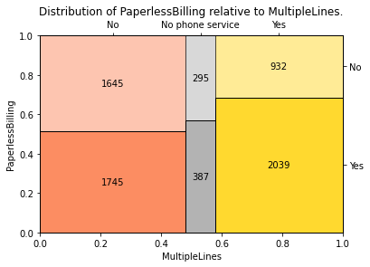

# plot_treemap
Custom function to plot a treemap-like diagram.

Plots an R-like treemap diagram.
Plots a visual relationship of two independent categorical variables.
X and Y axes show proportions of the size of the respective variables
by categories. Resulting squares area can be used to compare the size of
the groups in the intersection of categories.
Resembles a stacked barchart, but the width of the bars shows the relative
size of the x-values.

For better results, limit the number of categories to 4-5 for each of X and Y.

For a set of values: 
  `No                  3390` 
  `Yes                 2971` 
  `No phone service     682` 
and 
  `Yes    4171` 
  `No     2872` 
  
plots: 
  
